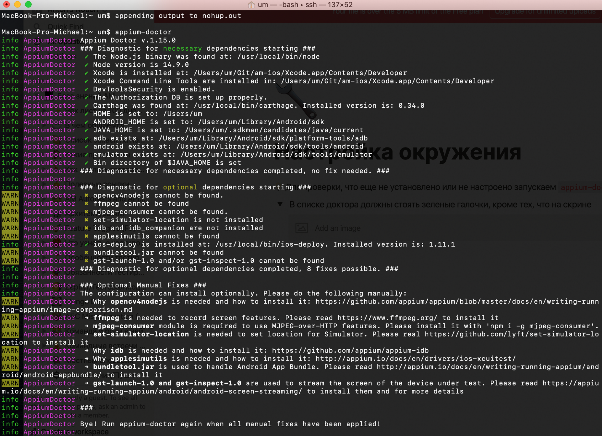

# Настройка окружения
## Установка компонентов
### npm
https://nodejs.org/ru/download/ - скачать и установить
### appium
Последовательно выполнить команды
```
npm install -g appium
npm install -g appium-doctor
npm install -g carthage
```
### appium inspector 
https://github.com/appium/appium-inspector/releases - скачать и установить последний релиз
### Java
Скачать Java 11 [здесь](https://www.techspot.com/downloads/5553-java-jdk.html)

Нажать кнопку Windows. Скачивание начнется автоматически

### Android Studio
Скачать и установить по [инструкции](https://docs.google.com/document/d/1UoGpQ0zC8kqkbt30BrYJtJAgur51lENd2hzlMhOdffY/edit#heading=h.ycdj7v5ywjpl)

### appium-doctor
Запустить аппиум доктор, убедиться, что все галки зеленые
    ```
    appium-doctor
    ```


## Запуск Appium inspector
1. Запустить эмулятор Android 9
2. Установить приложение VK на эмулятор
3. Запустить сервер
    ```
    appium -p 5566
    ```
4. Запустить Appium inspector
5. Создать сет desired capabilities
    ```
    {
      "platformName": "Android",
      "deviceName": "abm",
      "platformVersion": "9",
      "appPackage": "com.vkontakte.android",
      "appActivity": ".MainActivity"
    }
    ```
6. Нажать Start session
